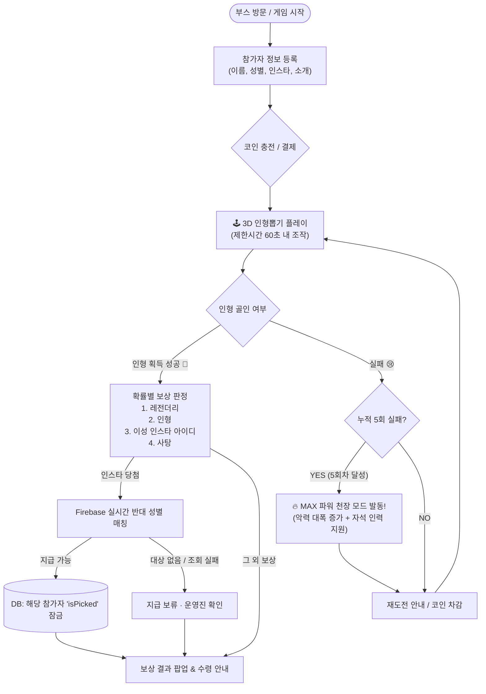

## 2026-09-26 Firebase 운영 주의

현재 변경은 **운영 빌드 전 테스트가 필요**합니다. 2026-09-27 운영 계정의 스태프 클레임과 게시된 `firestore.rules`로 익명 읽기 거부·스태프 읽기 허용을 확인했습니다. `FIREBASE_WEB_API_KEY`는 로컬 `.env`에만 있으며, `GameState/stats`의 실제 재고 입력과 실게임 쓰기·동시성·Windows 빌드 검증은 아직 필요합니다.

로컬 REST 요청 모의 검사는 `dotnet run --project Tests/FirestoreRest/FirestoreRestChecks.csproj`로 실행합니다. 이 검사는 실제 Firebase 접속이나 Windows 빌드 검증을 대신하지 않습니다.

인형뽑기는 인스타 ID를 필수로 확인하며 기존 참가자를 재사용합니다. 지급 확정이 불분명하면 하위 상품으로 자동 변경하지 않고 운영진이 처리합니다. 일반·레전드 재고는 사격·리듬과 공유합니다. 기존 데이터가 있다면 `admin_tools/migrate_participant_keys.py`로 정규화 인덱스와 이미 뽑힌 프로필 잠금을 먼저 준비하세요. 결제 금액과 코인 묶음은 변경하지 않았습니다. Windows 빌드와 별도 Firebase 프로젝트에서 네트워크 오류, 버튼 연타, 중복 참가자, 마지막 재고 동시 지급을 반드시 검증하세요.

플레이 기록은 `GameRounds` 영수증·매출/플레이 통계·참가자 `attempts`를 한 번에 저장합니다. 결과를 확인하지 못하면 다음 플레이를 막고 화면에 회차 ID를 남깁니다. 연결 복구 후 스태프가 `Ctrl+Alt+R`로 **같은 회차**를 재시도합니다. 게임 중 앱이 종료됐다면 로그의 회차 ID와 Firebase 영수증을 운영진이 대조해야 합니다.


# 🧸 러브캐처 (Love Catcher)
> **캠퍼스 축제 및 오프라인 행사를 위한 3D 물리 기반 아케이드 인형뽑기 소개팅 게임**

<div align="center">

-black?logo=unity&logoColor=white)


-yellow?logo=firebase&logoColor=white)


</div>

---

## 📌 목차
1. [📖 프로젝트 소개](#-프로젝트-소개)
2. [🔄 핵심 게임 플로우](#-핵심-게임-플로우)
3. [✨ 주요 기능 및 시스템](#-주요-기능-및-시스템)
4. [⚡ 빠른 시작 및 환경설정 가이드](#-빠른-시작-및-환경설정-가이드)
   - [1. 필수 요구사항](#1-필수-요구사항)
   - [2. 프로젝트 열기](#2-프로젝트-열기)
   - [3. 환경변수(.env) 설정](#3-환경변수env-설정)
   - [4. Firebase Firestore 셋업](#4-firebase-firestore-셋업)
   - [5. 현장 부스 커스터마이징 (QR / 계좌)](#5-현장-부스-커스터마이징-qr--계좌)
5. [🎮 조작 방법 및 단축키](#-조작-방법-및-단축키)
6. [🛠️ 운영자 / 관리자 모드 (Dev Mode)](#-운영자--관리자-모드-dev-mode)
7. [🔌 하드웨어 연동 가이드 (아케이드 기판)](#-하드웨어-연동-가이드-아케이드-기판)
8. [📁 프로젝트 디렉토리 구조](#-프로젝트-디렉토리-구조)
9. [👥 기획 및 개발](#-기획-및-개발)

---

## 📖 프로젝트 소개

**러브캐처(Love Catcher)**는 대학 축제나 오프라인 부스 행사에서 참가자들의 자연스러운 만남과 재미를 극대화하기 위해 기획된 **인형뽑기 소개팅 아케이드 게임**입니다.

- 🕹️ **리얼 물리 엔진 기반 손맛**: 단순 스크립트 애니메이션이 아닌 Unity PhysX(`HingeJoint`, `Motor`) 기반의 실제 집게 물리와 마찰력을 구현했습니다.
- 💘 **실시간 스마트 이성 매칭**: 인형을 획득하면 참가자의 성별 정보를 바탕으로 **Firebase Firestore에서 아직 매칭되지 않은 반대 성별 참가자의 인스타그램 프로필 카드가 실시간 매칭**됩니다.
- ☁️ **경량 REST API 백엔드**: `UnityWebRequest`로 인증된 Firestore REST 요청을 보냅니다. 연결이 끊기면 지급을 보류하고 운영진이 처리합니다.
- 🛡️ **완벽한 환경설정 분리**: `.env` 환경변수 시스템을 지원하여 Firebase 프로젝트 ID나 부스 결제 계좌 등의 민감 정보 노출 없이 안전하게 공유 및 배포할 수 있습니다.

---

## 🔄 핵심 게임 플로우



---

## ✨ 주요 기능 및 시스템

### 1. 🕹️ 리얼 피지컬 집게 시스템 (`ClawGripper`, `ClawMachineController`)
- 집게 4개 발 관절마다 `HingeJoint` 모터를 적용하고 실시간 악력(`Motor.force`)과 속도를 계산합니다.
- 물리 마찰 재질(`Physics Material`)과 래그돌 구조의 하트 인형을 결합해 잡았다가 미끄러지는 아케이드 특유의 쫄깃한 긴장감을 선사합니다.

### 2. 💘 스마트 이성 매칭 & 유연한 보상 룰 (`GameFlowManager`)
- 플레이어의 성별을 판별하여 DB 내 **반대 성별 풀 중 아직 뽑히지 않은(`isPicked == false`) 참가자**를 무작위 추천합니다.
- 성별별 당첨 확률 튜닝(남성/여성 차등 확률) 지원.
- 4가지 보상 타입(레전더리, 인형, 이성 인스타 아이디, 사탕)을 설정 확률로 추첨합니다. 인스타 당첨 후 대상 조회·확정이 실패하면 지급을 보류하고 운영진이 확인합니다.

### 3. 🔥 실패 방지 천장(Pity) 자석 어시스트 (`ClawPityMagnet`)
- 연속 5회차 실패 시 화면에 "🔥 **MAX 파워 모드 발동!** 🔥" 배너가 표시됩니다.
- 집게 악력 모터 파워가 1.5배 이상 버프되며, 집게 중심에 자석 인력 트리거가 켜져 근접한 인형을 흡착 보정해줍니다.

### 4. ☁️ SDK-Free Firebase Firestore REST 통신 (`FirebaseRESTService`)
- 공식 SDK 없이 경량 HTTP REST API로 구글 Firestore와 직접 통신합니다.
- 스태프 인증을 거친 참가자 등록·중복 확인, 원자적 프로필 선점과 인형 재고 차감, 누적 매출 기록을 지원합니다.

### 5. 💰 현장 운영 최적화 코인 시스템 & 리텐션 UX (`ClawMachineUIManager`)
- **현장 결제 패키지**: 1회(500원), 3회(1,500원), 6회(2,500원), 13회(5,000원) 원클릭 코인 충전 지원.
- 다회권 충전 시 실패 후 번거로운 절차 없이 즉시 다음 판이 연이어 시작됩니다.
- 실패 시 10종의 귀여운 위로 멘트와 이모지 랜덤 출력, 실수로 그만두는 것을 방지하는 리텐션 확인 모달을 제공합니다.

---

## ⚡ 빠른 시작 및 환경설정 가이드

### 1. 필수 요구사항
- **Unity Editor**: `Unity 6 (6000.2.10f1)` 이상
- **OS**: Windows 10 / 11 (권장)
- **인터넷 연결**: Firebase Firestore 연동과 지급 확정에 필수입니다. 끊기면 지급을 보류합니다.

### 2. 프로젝트 열기
1. 본 레포지토리를 클론합니다:
   ```bash
   git clone https://github.com/Sarisol0510/love_catcher.git
   cd love_catcher
   ```
2. **Unity Hub**를 실행하고 **Add(열기)** 버튼을 클릭하여 `love_catcher` 폴더를 추가합니다.
3. Unity 6000.2.10f1 에디터로 프로젝트를 실행합니다.
4. `Assets/Scenes/SampleScene.unity` 씬을 엽니다.

---

### 3. 환경변수(.env) 설정

본 프로젝트는 보안을 위해 프로젝트 ID 및 부스 정보를 `.env` 파일로 관리합니다.

1. 프로젝트 루트 폴더에 위치한 `.env.example` 파일을 복사하여 `.env` 파일을 생성합니다:
   ```powershell
   # PowerShell
   Copy-Item .env.example .env
   ```
   *(또는 파일 탐색기에서 `.env.example`을 복사하여 이름을 `.env`로 변경)*

2. 생성된 `.env` 파일을 텍스트 에디터로 열고 본인의 정보로 수정합니다:
   ```env
   # [필수] Firebase 프로젝트 고유 ID
   FIREBASE_PROJECT_ID=your-firebase-project-id

   # [선택] 결제 안내 팝업에 노출될 계좌번호 및 예금주
   BANK_ACCOUNT_INFO=🏦 토스뱅크 0000-0000-0000 홍길동 🏦
   ```

> 💡 **안내**: `.env` 파일은 `.gitignore`에 등록되어 있으므로 Git 커밋 시 외부에 노출되지 않습니다.

---

### 4. Firebase Firestore 셋업

러브캐처는 참가자 정보 및 현장 통계를 Firebase Firestore에 저장합니다.

1. [Firebase 콘솔](https://console.firebase.google.com/)에 접속하여 새 프로젝트를 생성합니다.
2. 좌측 메뉴에서 **빌드 > Firestore Database**를 선택하고 **데이터베이스 만들기**를 클릭합니다.
3. 운영 프로젝트에는 `firestore.rules`를 게시했고 익명 읽기 거부·스태프 읽기 허용을 확인했습니다. 별도 테스트 프로젝트에서 무인증·일반 계정의 쓰기 거부와 게임의 동시 쓰기를 추가로 검증합니다. 전체 공개 규칙은 사용하지 않습니다.
4. Firebase Authentication 이메일/비밀번호 제공자와 스태프 계정을 설정하고, `admin_tools/grant_staff_claim.py`로 `boothStaff` 클레임을 부여합니다. 재고 수정 담당자에게는 `boothAdmin`도 부여합니다. 계정 비밀번호와 서비스 계정 키는 저장소에 올리지 않습니다.
5. 같은 Firebase 프로젝트의 Web API Key를 `FIREBASE_WEB_API_KEY` 또는 `Assets/Resources/FirebaseConfig.json`에 입력합니다. 기존 참가자가 있으면 `admin_tools/migrate_participant_keys.py`로 인덱스를 먼저 준비합니다.
6. `GameState/stats`에 `totalDolls`, `totalLegendaryDolls`, `totalRevenue`, `totalRegistrations`, `totalPlays`, `totalSuccesses`를 정수로 만들고 실제 초기 재고를 입력합니다. 이 문서가 없으면 지급하지 않습니다.

#### 🗄️ Firestore 컬렉션 구조
게임이 실행되면 자동으로 아래 컬렉션이 사용됩니다:
- `Participants` 컬렉션:
  - `name` (string): 참가자 이름
  - `gender` (string): 성별 (`"남"` 또는 `"여"`)
  - `insta` (string): 소문자로 정규화한 인스타그램 아이디 (예: `my_id`)
  - `bio` (string): 한줄 소개
  - `isPicked` (boolean): 매칭 완료 여부 (뽑히면 `true`로 잠금)
  - `attempts` (integer): 누적 시도 횟수
- `GameState/stats` 문서:
  - `totalDolls` (integer): 남은 실물 인형 재고 수량
  - `totalLegendaryDolls` (integer): 남은 레전더리 인형 재고 수량(운영진이 초기값 설정)
  - `totalRevenue` (integer): 현장 총 누적 매출 (원)
  - `totalRegistrations` (integer): 총 참가 등록 수
  - `totalPlays` (integer): 총 플레이 수
  - `totalSuccesses` (integer): 총 뽑기 성공 수

---

### 5. 현장 부스 커스터마이징 (QR / 계좌)

실제 축제 부스에서 운영하기 위한 필수 커스텀 단계입니다:

1. **결제 QR 코드 교체**:
   - 카카오페이 또는 토스 송금 QR 이미지를 캡처/저장합니다.
   - 이미지를 `Assets/결제 QR.png` 파일에 덮어씌웁니다. (Unity 에디터가 자동으로 텍스처를 갱신합니다.)
2. **부스 계좌번호 수정**:
   - `.env` 파일의 `BANK_ACCOUNT_INFO` 항목을 본인 부스의 계좌로 변경합니다:
     ```env
     BANK_ACCOUNT_INFO=🏦 카카오뱅크 3333-00-0000000 김부스 🏦
     ```
   - 게임 실행 시 충전 팝업 하단에 해당 계좌 정보가 자동으로 반영됩니다.

---

## 🎮 조작 방법 및 단축키

### 🕹️ 플레이어 기본 조작
| 조작 액션 | 키보드 | 아케이드 컨트롤러 / 게임패드 |
| :--- | :--- | :--- |
| **집게 전/후/좌/우 이동** | `W`, `A`, `S`, `D` 또는 방향키 (`↑`, `←`, `↓`, `→`) | 조이스틱 레버 (X / Y 축) |
| **집게 하강 및 잡기** | <kbd>Spacebar</kbd> | 아케이드 푸시 버튼 / 패드 South (<kbd>A</kbd>) |
| **UI 메뉴 좌/우 이동** | `A` / `D` 또는 `←` / `→` | 조이스틱 레버 좌 / 우 틸트 |
| **UI 확인 및 선택** | <kbd>Spacebar</kbd> 또는 <kbd>Enter</kbd> | 아케이드 푸시 버튼 |

### 🛠️ 운영자 전용 긴급 단축키
| 단축키 | 기능 설명 |
| :--- | :--- |
| <kbd>Ctrl</kbd> + <kbd>Alt</kbd> + <kbd>L</kbd> | **운영자 / 개발자 모드 (Dev Mode) 대시보드 열기 / 닫기** |
| <kbd>R</kbd> | **즉시 라운드 리셋** (물리 끼임 등 돌발 상황 발생 시 강제 복구) |

---

## 🛠️ 운영자 / 관리자 모드 (Dev Mode)

부스 운영 중 예기치 못한 상황(인터넷 지연, 악력 조절, 재고 변경, 참가자 요청)에 즉각 대응할 수 있는 전용 관리자 대시보드를 제공합니다.

> 실행 단축키: <kbd>Ctrl</kbd> + <kbd>Alt</kbd> + <kbd>L</kbd>

1. **실시간 현장 통계 대시보드**
   - 총 참가 등록 수, 누적 플레이 수, 인형 획득 성공 수, 실시간 매출 집계 확인 및 수동 보정/초기화
2. **참가자 DB 실시간 관리자 (`DevDbOverlay`)**
   - 실시간 참가자 검색 (이름 기반 필터링)
   - 참가자 정보(이름, 인스타, 소개, 뽑힘 여부) 현장 즉각 수정 및 삭제
   - 긴급 현장 수동 참가자 등록 폼
   - 참가자 전원 매칭 상태 일괄 초기화 (`Reset All Picked Status`)
3. **물리 & 게임 밸런스 실시간 튜닝**
   - 집게 기본 악력(Grip Force) 슬라이더 조절 (손맛 실시간 튜닝)
   - 성별 당첨 확률 및 보상 타입별 가중치 조절
   - 인스타 제외 모드 토글 (일반 인형뽑기로 즉각 전환 가능)
   - 남은 실물 인형 재고 수량 수정 및 DB 실시간 동기화

---

## 🔌 하드웨어 연동 가이드 (아케이드 기판)

본 프로젝트는 실제 오프라인 아케이드 캐비닛과 100% 호환되도록 개발되었습니다.

```
[인형뽑기용 조이스틱 레버] + [아케이드 대형 버튼]
                     ↓ (신호선 연결)
       [Zero Delay Arcade USB 인코더 기판]
                     ↓ (USB 케이블 연결)
             [부스 운영 PC (Windows)]
                     ↓ (Unity New Input System)
                🎮 Love Catcher 실행
```

1. **추천 하드웨어**:
   - **Zero Delay Arcade USB Encoder Board** (PC 연결 시 표준 USB HID 게임패드로 인식)
   - 마이크로스위치 타입 4/8방향 조이스틱 레버
   - 30mm/24mm 아케이드 푸시 버튼
2. **연결 및 설정**:
   - Windows PC에 USB 케이블을 꽂으면 별도 드라이버 설치 없이 즉시 표준 조이스틱으로 인식됩니다.
   - `ArcadeInputManager`에서 `<Joystick>/stick` 및 `<Joystick>/trigger` 입력을 자동으로 수신합니다.

---

## 📁 프로젝트 디렉토리 구조

```
love_catcher/
├── .env.example                          # 환경변수 템플릿 파일
├── Assets/
│   ├── Cosmic_Retro_MessHall_Props_FREE/ # 3D 프랍 및 부스 환경 에셋
│   ├── Editor/                           # 에디터 툴 및 유틸리티
│   ├── Materials/                        # 머티리얼 및 고마찰 피직스 재질
│   ├── Models/                           # 기계 외관 및 3D 모델
│   ├── Prefab/                           # 집게, 인형(Ragdoll), 기계 프리팹
│   ├── Resources/
│   │   └── FirebaseConfig.json           # Firebase 설정 템플릿
│   ├── Scenes/
│   │   └── SampleScene.unity             # 메인 게임 씬
│   ├── Scripts/
│   │   ├── Audio/
│   │   │   └── SoundManager.cs           # BGM 및 SFX 사운드 관리기
│   │   ├── Input/
│   │   │   └── ArcadeInputManager.cs     # 조이스틱 / 키보드 입력 통합 바인딩
│   │   ├── Mechanics/
│   │   │   ├── ClawGripper.cs            # 집게 모터 악력 및 버프 연산
│   │   │   ├── ClawMachineController.cs  # 집게 상태 머신 및 이동 로직
│   │   │   ├── ClawPityMagnet.cs         # 천장 발동 시 미세 인력 자석 제어
│   │   │   ├── DollSpawner.cs            # 인형 오브젝트 풀링 및 생성
│   │   │   ├── FirebaseRESTService.cs    # Firestore REST 통신 서비스
│   │   │   ├── GameFlowManager.cs        # 라운드 제어 및 매칭 로직
│   │   │   ├── GoalBoxTrigger.cs         # 배출구 감지 센서
│   │   │   └── PlushieDoll.cs            # 인형 물리 특성
│   │   ├── UI/
│   │   │   └── ClawMachineUIManager.cs   # UI Toolkit HUD, 모달, Dev Mode 제어
│   │   └── Utils/
│   │       └── EnvLoader.cs              # .env 환경변수 자동 로더
│   ├── Settings/                         # URP 그래픽 파이프라인 프로파일
│   ├── UI/                               # UXML 화면 정의서 및 USS 스타일시트
│   └── 결제 QR.png                       # 부스 결제 안내 QR 이미지 (커스텀 가능)
├── Packages/                             # 패키지 매니페스트 (URP, Input System 등)
├── ProjectSettings/                      # 유니티 프로젝트 전역 설정
└── GameDesignDocument.md                 # 오리지널 게임 기획 문서
```

---

## 👥 기획 및 개발

- **기획 & 개발**: Sarisol0510 ([GitHub](https://github.com/Sarisol0510))
- **라이선스**: [MIT License](LICENSE) (상업적 이용 및 축제 부스 활용 환영)
- **문의**: GitHub 이슈 트래커를 이용해주세요.
